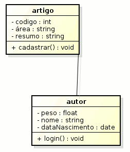
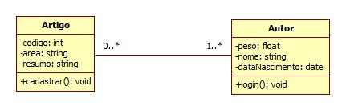

# Associação

Na linguagem UML uma associação define que duas classes se relacionam entre elas, podendo passar objetos entre si e se comunicarem. É um tipo simples de relação, pois não se consegue visualizar a direção da mensagem, se tornando uma associação bidirecional. Em refinamentos no diagrama de classes, esta pode ser substituída por uma dependência estrutural, por exemplo, mas este é um assunto para outro texto.

## Exemplo de Associação

Observe a imagem a seguir:



Imagem 1 - Exemplo de Associação

Na imagem anterior podemos observar uma relação de associação entre a classe autor e artigo. Em outras palavras, o diagrama quer dizer o seguinte: "Um autor escreve artigo". Porém, esse diagrama pode e deve aperfeiçoado com a multiplicidade que será abordada logo a seguir.

## Multiplicidade

Multiplicidade é usado para determinar quantos objetos daquela classe são necessários para se associar com o número mínimo é máximo de objetos da outra classe. Para ilustrar melhor, veja o exemplo a seguir da classe anterior, porém com multiplicidade na associação:



Imagem 2 - Associação com Multiplicidade

Agora com a multiplicidade no diagrama é possível dizer que:

* Um autor pode escrever vários artigos.

* um autor pode não escrever artigos.

* Um artigo pode ser escrito por vários autores, mas no mínimo um autor.

## Associação e Multiplicidade em C++

Já que temos que lidar com diversos objetos, é necessário usar um container da biblioteca STL, o vector.

## O que é a Classe Vector?

A classe vector se comporta como uma matriz e assim que um elemento é adicionado esta cresce dinamicamente, alocando espaço na memória. É possível acessar objetos com iteradores e também ponteiros de elementos.

## Classe autor e artigo sendo implementadas em C++

Desta forma podemos programar as classes do diagrama mostrado nesse texto:

* Classe Autor:

```CPP
#ifndef Autor_HPP
#define Autor_HPP

#include <iostream>
#include <vector>
#include <string>
#include "Artigo.hpp"

using namespace std;

class Autor{
private:
	vector<Artigo *> artigo;
	float peso;
	string nome;
	int dia, mes, ano;
public:
	void login();
};

#endif
```

* Classe Artigo:

``` CPP
  #ifndef Artigo_HPP
#define Artigo_HPP

#include <iostream>
#include <string>
#include <vector>
#include "Autor.hpp"

using namespace std;

class Artigo{
private:
	vector<Autor *> autores;
	int codigo;
	string area;
	string resumo;

public:
	void cadastrar();
};

#endif
  ```
