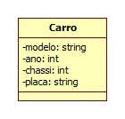

# Getters e Setters em C++

Get e Set são métodos que tem o objetivo de retornar o conteúdo e inserir informação no atributo privado, respectivamente. Mas você deve estar se perguntando: "Ok, mas por que fazer isso sendo que posso inserir um conteúdo ou retornar sua informação diretamente?". Olhando por esse lado, existe alguma lógica, mas você vai deixar qualquer informação ser inserida nos atributos das sua(s) classe(s) sem que haja uma verificação antes? É aí que entra o conceito de encapsulamento.


## Encapsulamento

O encapsulamento tem o objetivo de ocultar informações para que elas fiquem seguras. Porém, apenas o encapsulamento não resolve, é necessário também mudar a visibilidade dos atributos para private.

## Implementando Get e Set em C++

Considere a classe a seguir:



Imagem 1 - Classe Carro

Como podemos observar na imagem, a classe Carro possui 4 atributos: modelo, ano, chassi e placa. Todos do tipo privado.

## Por que não colocar os atributos get e set na classe?

Porque a classe ficará com muitos métodos redundantes, já que quando é declarado atributos privados obviamente e por necessidade haverá métodos get e set para cada atributo.


## Como implmentar Getters e Setters em C++?

Vamos utilizar a mesma classe Carro para a programação:

Classe Carro.hpp:

```cpp
#ifndef Carro_hpp
#define Carro_hpp

#include <string>

using namespace std;

class Carro{
private:
	string modelo;
	int ano;
	int chassi;
	string placa;

public:
	void setModelo(string modelo);
	string getModelo();
	void setAno(int ano);
	int getAno();
	void setChassi(int chassi);
	int getChassi();
	void setPlaca(string placa);
	string getPlaca();
};

#endif
```

Classe Carro.cpp:

```cpp
#include "Carro.hpp"
#include <string>

using namespace std;

int Carro::getAno(){
	return Carro::ano;
}

void Carro::setAno(int ano){
	this->ano = ano;
}

int Carro::getChassi(){
	return Carro::chassi;
}

void Carro::setChassi(int chassi){
	this->chassi=chassi;
}

string Carro::getModelo(){
	return Carro::modelo;
}

void Carro::setModelo(std::string modelo){
	this->modelo = modelo;
}

string Carro::getPlaca(){
	return Carro::placa;
}

void Carro::setPlaca(std::string placa){
	this->placa = placa;
}

```

## Referências:

[Encapsulamento de dados e ocultação da informação](http://www.dsc.ufcg.edu.br/~pet/jornal/junho2013/materias/recapitulando.html)

[Princípios S.O.L.I.D.
](http://marceloweb.info/principios-s-o-l-i-d/)

[O que são e para que servem os métodos get e set
](http://www.javaprogressivo.net/2012/10/set-e-get-o-que-sao-e-como-usar-esses-metodos-de-forma-correta.html)

[Get e Set - Métodos Acessores
](http://www.tiexpert.net/programacao/java/get-set.php)
